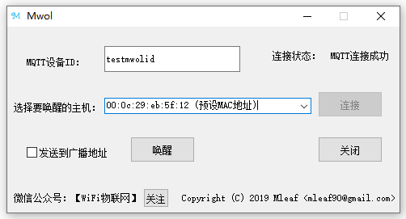

<p align="center">

</p>

[![license][1]][2]

[1]: https://img.shields.io/badge/license-GPLV3-brightgreen.svg?style=plastic
[2]: http://192.168.1.225:3000/mleaf/mwol/src/master/COPYING

## 关于 Mwol
Mwol (Mqtt wake on lan), 是在原版【wakeonlan】的基础上，增加【MQTT】通信。

使得【wakeonlan】的使用不再局限于拥有公网IP，以及使用N2N，Zerotier，Ngrok 等内网穿透的机器。

使用【MQTT】通信，可以选择使用TLS加密，安全可靠。

配合博主写的PC端软件，随时随地方便的唤醒家里的PC机，当然如果有会写手机端APP的朋友也可以做一个手机端app，方便手机端唤醒PC机。

当然如果要用手机端唤醒PC目前也有手机端的MQTT调试工具可供使用。

## windows客户端展示
<p align="center">

</p>

## 协议说明

1.客户端通过MQTT协议发送如下json数据获取mwol当前arp数据列表
```
{
	"header": {
		"action": "arp"
	},
	"payload": {}
}
```

2.mwol通过MQTT协议返回当前arp数据列表
```
{
	"header": {
		"action": "arpList"
	},
	"payload": {
		"deviceId": "testmwolid",
		"data": [{
				"mac": "00:03:7f:11:23:1f",
				"ip": "192.168.10.123",
				"hostName": "preset mac"
			},
			{
				"mac": "00:25:22:42:b6:93",
				"ip": "192.168.10.235",
				"hostName": "DESKTOP-VVNKNR8.lan"
			},
			{
				"mac": "00:03:7f:12:23:1f",
				"ip": "192.168.10.113",
				"hostName": "* *"
			}
		]
	}
}
```

3.客户端通过MQTT协议发送如下json数据唤醒指定pc机，也可以选择任意mac地址,broadcast设置为true，进行广播
```
{
	"header": {
		"action": "wol"
	},
	"payload": {
		"deviceId": "testmwolid",
		"mac": "00:03:7f:11:23:1f",
		"broadcast": true
	}
}
```

4.Mwol收到激活信息后，返回如下数据
```
{
	"header": {
		"action": "wol"
	},
	"payload": {
		"mac": "00:03:7f:11:23:1f",
		"status": "success"
	}
}
```

---

## 感谢如下开源项目提供的思路和帮助：

- http://http.debian.net/debian/pool/main/w/wakeonlan/  

- https://github.com/DaveGamble/cJSON

----


## 欢迎加qq群讨论： [36186139](https://jq.qq.com/?_wv=1027&k=5kuzQBr)

## 欢迎关注微信公众号获取最新动态
<p align="center">

</p>

## 捐赠
<p align="center">

</p>

## 如果该项目对您有帮助，请毫不犹豫点star，谢谢！
